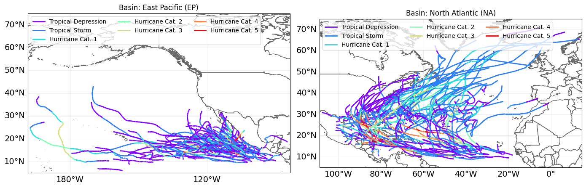
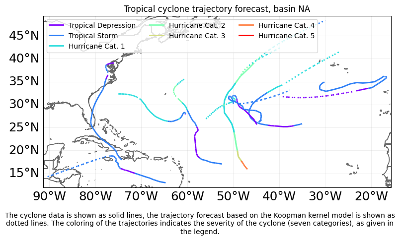
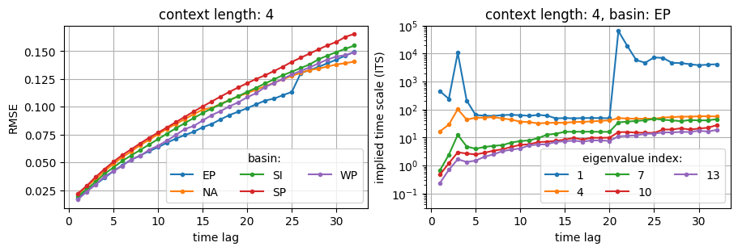
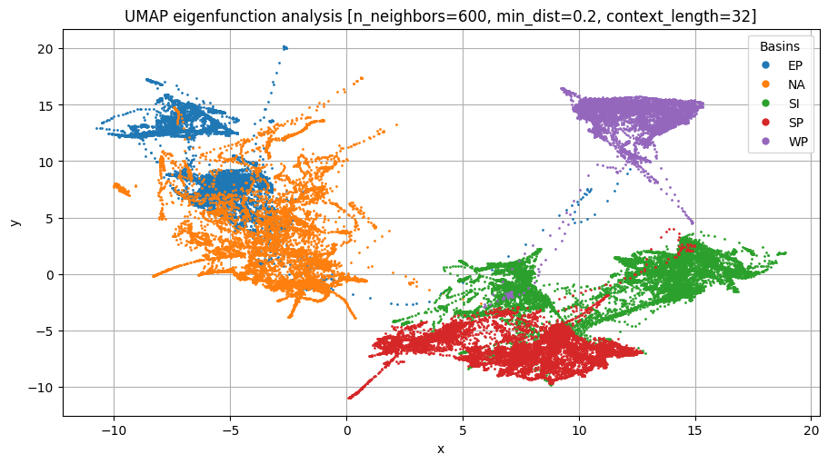
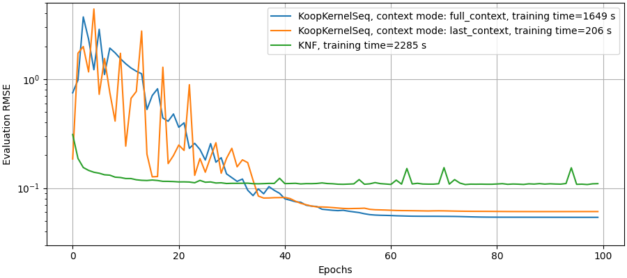

# Koopman operator learning for Tropical Cylones


In this repository I test the applicability of the Koopman operator framework to analyse
and predict the dynamics of tropical cylones. Based on these prediction models, we can 
assess the economical impact and risk associated with future cyclone events.

The Koopman operator allows to capture complex, nonlinear dyanmics via a infinite-dimensional linear operator.
Finite dimensional approximations of the Koopman operator can be used for example spectral analysis of nonlinear
systems and forecasting of nonlinear dynamics.
For this study, the [CLIMADA](https://github.com/CLIMADA-project/climada_python) python package serves as a starting point. It
provides tropical cylone track data, and has build-in functionalities for risk assessment and economic exposure analysis.


## Setup
To install the project, first clone the repository, and then run from the project folder:
```
python -m venv .venv
```
To activate the environment, run
```
source .venv/bin/activate
```
on Mac and Linux, or
```
.venv\Scripts\activate
```
on Windows.

To install the package, first we have to install the CLIMADA dependency. This has to be done directly from GitHub, as PyPI does not include the latest CLIMADA package versions.
First navigate to the location where you want to clone the CLIMADA github repostitory, then run
```
git clone https://github.com/CLIMADA-project/climada_python.git
```
With activated venv, navigate to the root of the climada_python repository and run
```
pip install -e .
```
Similar, navigate to the root folder of the koopkernel_sequencer repository and run
```
pip install -e .
```
You can also add the following config setting `pip install -e . --config-settings editable_mode=strict` to make sure that pylance recognizes the package.

After this, navigate back to the root of this project and run
```
pip install -e .
```
to install the project.

To install torch CUDA, please follow the instructions at https://pytorch.org/get-started/locally/ depending on your CUDA version.s

For Compute Platform CUDA 12.6 and higher one can use the following

```
pip3 install torch torchvision torchaudio --index-url https://download.pytorch.org/whl/cu126
```


# Project description

## Koopman kernel based trajectory analysis

### Tropical cylones
We use the CLIMADA package to import tropical cyclone dataset and for plotting. There are five main basins of tropical cylones, which are mainly considered in this repository:: East Pacific (EP), North Atlantic (NA), South Indian Ocean (SI), South Pacific (SP) and West Pacific (WP).

Below we show example tracks of tropical cyclones in the East Pacific (left) and the North Atlantic (right).

The color of the track indicate the severity of the cyclone/hurricane, which is classified into seven severity levels from "Tropical Depression" to "Hurrican Category 5", see legend.

The notebook `examples/koopman_kernel_for_TC.ipynb` introduces the tropical cyclone dataset (imported from CLIMADA) and the main data structure used in this repository. Examples of cyclone trajectories are plotted and different Koopman kernel models (implemented in kooplearn) are compared. Also the necessary preporcessing steps for model training are described in this notebook.


### Forecasting cylone trajectories and severity levels
Based on the trained Koopman kernel models, we can forecast the future trajectories and severity of new tropical cyclones. Such forecasts can be used for further downstream tasks such as risk assessment and economical impact calculations of such events.
In the plot below, the cyclone forecasting is exemplified via some test cyclone tracks (solid lines are the original trajectory, dotted lines the prediction based on our model).




### Spectral consistency analysis and implied time scale
[see `examples/koopman_kernel_for_TC_spectral_consistency_analysis.ipynb`]

From the spectrum of the Koopman operator one can obtain the time scales of the dynamical modes of the system. An important test for spectral consistency considers the scaling of implied time scales (ITS) as we vary the internal time unit of the dynamics. This can be controlled by the `time_lag` parameter, setting the time step between consecutive observation points.
As we increase the internal time unit of the system, the eigenvalues should become smaller and the associated dyanmics should become faster (i.e. a decrease of the time scale). However, the implied time scale, which is the product of time lag and time scale, should stay relatively constant.



In the left plot we observe that the RMSE monotonically increases with the time lag, but with decreasing slope.
For large time lags it might eventually converge to a fixed value.
In the right plot we show the implied time scales from five selected eigenvalues of the Koopman operator.
We observe a typical behavior, where initially the ITS increases, but for larger time lags the ITS converges to a constant value. This verifies the consistency of our model. As we increase the implicit time unit of our model (controlled by the time lag of the training data) the ITS should stay constant.
Additionally we observe a strong fluctuation of the largest shown eigenvalue (smallest index), which is very close to the theoretical maximum of one.
This shows that our eigenvalue computation is unstable close to the steady state (corresponding to the eigenvalue one), which is, however, expected when training the Koopman kernel models on limited real world data. The lower eigenvalues (larger index) show a much more stable behavior.


### Koopman eigenfunction analysis
[see `examples/koopman_kernel_for_TC_Koopman_eigenfunctions.ipynb`]

Another aspect is the dynamical characterization of the different basins via a spectral analysis of the corresponding Koopman operators. The Koopman modes characterize the dynamics and can be used to identify and discriminate dynamical signatures of the basins.
We study the dynamical imprint of the tropical cyclone tracks on the eigenfunctions of the Koopman operator. For this we compare the five most important basins EP, NA, SI, SP, WP. For each basin we generate the corresponding Koopman operator, and project the tropical cyclone tracks onto the first 10 eigenfunctions of each Koopman operator. Combining the coordinates for each basin, we obtain a relatively low-dimensional data vector characterized by the dynamical features of each basin.



The plot shows the eigenfunction coordinates, embedded into a two-dimensional feature space for visualization. The embedding is obtain with the nonlinear dimensionality reduction algorithm UMAP. The basins are identifiable as five clusters, partially overlapping. This shows that each basin boasts specific dynamical properties which are revealed by our data-driven analysis. Especially basin WP builds a single cluster well seperated from all the other basins, and thus shows the most unique tropical cyclone dynamics.
The identified nonlinear features are sufficient to discriminate the basins reasonably well and can be used, e.g., for classification of new tropical cyclone tracks.


## Koopman Kernel Sequencer (kernel-based sequence model architecture)

[For details see `examples/koopman_kernel_sequencer.ipynb`]

The [Koopman Neural Forecaster](https://github.com/google-research/google-research/tree/master/KNF) is a deep learning architecture inspired by the Koopman operator framework. However, there are some parts of the architecture that are not very well grounded in Koopman operator theory. An additional downside of the approach are potentially unsuitable observable functions (which are hard-coded in the architecture).

To improve upon the Koopman Neural Forecaster, I develop a deep learning architecture that more directly combines Koopman kernel methods with a seq2seq architecture. Using kernels alleviates the problem of observable selection. However, kernels usually require to read in and process the full dataset, which is exactly what you do not want to do in seq2seq models. The implementation is using Nystroem kernel techniques.

Below, evaluation RMSE are compared for the KNF and the Koopman Kernel Sequencer. For details see `examples/koopman_kernel_sequencer.ipynb`, Sec. "Import trained model".



Note that there are several architectural hyperparameter for ther Koopman Kernel Sequencer. One is the `context_mode`, which controls whether the next time step is predicted for each time step in the context window (`full_context`), or only for the last time step (`last_context`, orange line). The former (blue line) achieves lower RMSE values, however the training is more expensive, as can be seen from the training runtime reported in the legend. Both version of the Koopman Kernel Sequencer outperform KNF (green line) both in terms of RMSE and in terms of training runtime.


## Koopman Neural Forecaster:

### Comparing kooplearn to the Koopman Neural Forecaster

First tests of the Koopman Neural Forecaster and plotting predictions of pre-trained models in `examples/knf_for_TC_first_example.ipynb` and `examples/knf_for_TC_plot_predictions.ipynb`.

The kooplearn package implements a kernel-based approach for
approximating Koopman operators in reproducing kernel Hilberg spaces (see [kooplearn](https://github.com/Machine-Learning-Dynamical-Systems/kooplearn) python package).
I want to compare this approach to a transformer-based deep neurel network architecture [Koopman Neural Forecaster](https://github.com/google-research/google-research/tree/master/KNF).
This architecture is build from a local and a global Koopman operator (implemented as trainable deep neural networks (multi-layer perceptron and
transformers)), both capturing local respectively global behaviour of the time series. This is combined with a feedback loop,
that is designed to capture and correct for spontaneous, sudden shifts and distortions in the temporal distribution.

For the Koopman Neural Forecaster, I plan to test several potential improvement directions. For example the selection of observable functions seems sub-optimal. There is some redundancy in the observable functions and there are only very few non-linear functions (discussed in more detail below), which are crucial for learning non-linear dynamics. Apart from reducing redundancy and increasing the non-linearity content of the observable functions, I aim to replace the (slow) attention mechanism with random feature kernels as described in [Rethinking Attention with Performers](https://arxiv.org/abs/2009.14794).


<!-- ## Contributions

#### Model improvements
- Implementation of additive combination of global and local Koopman operator:
    - although the authors described this additive combination in the paper, they implemented multiplicative combination in the code
    - additive combination seems much more natural from a perspective based on Koopman operator theory
    - in first tests, additive combination performs better than the multiplicative option
- Comparison between Koopman kernel regression and deep neural network transformer architecture

#### Data processing
- Conversion of CLIMADA TCTracks into kooplearn and pytorch compatible data structures
- Data quality and extract characteristic length scale from data (needed for kooplearn kernal models)
- Data standardization and periodic centering of earth scale tropical cyclone data (discontinuous cut along the longitudinal coordinate for $\mathrm{lon} = +- 180^\circ$) -->

